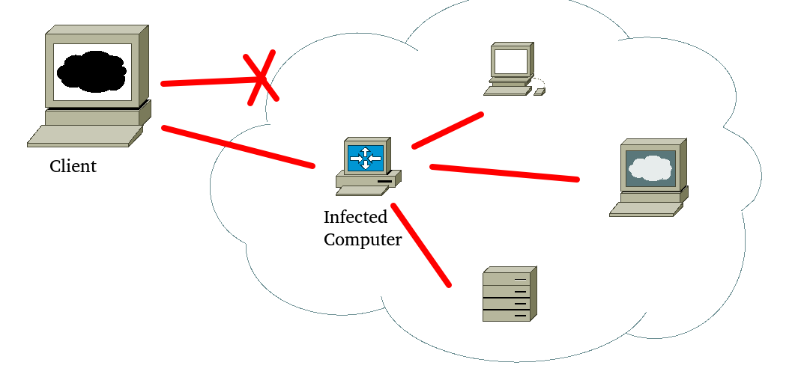

# ProxyVirus
A virus that bounces your signal to other devices inside the network via de outside.

The program gives you access into the internal network from the outside via an infected computer.
You can use the program as an IP hider too, the program won't have log files and it is a daemon.

Todo's:

-Deleting log files from system?

-Using SSL trough socket.

-Curl 

(c) 2020 Trisna Quebe all rights reserved
